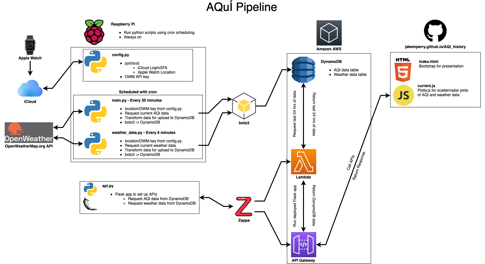
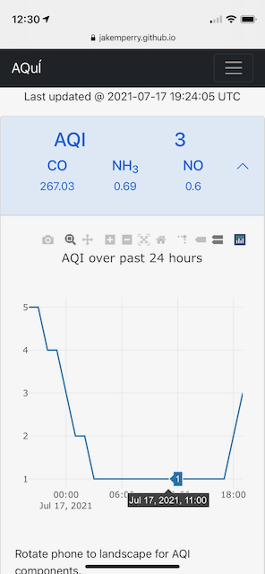
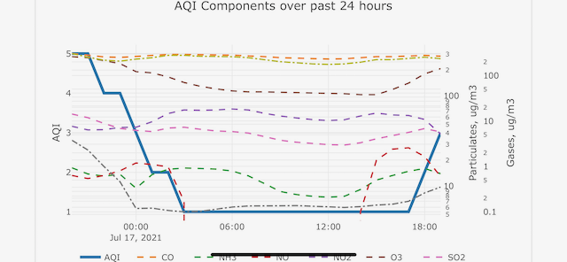

# AQuÍ: AQI History
Tracking Air Quality Index (AQI) numbers and weather data over time, based on current location over time.

## Overview
Growing up in southern California, I've been aware of and exposed to a good amount of smog and air pollution.  With seasonal wildfires also in the mix, I thought it might be interesting to track the AQI around me over time, to see if there are any trends and to see if I feel any of the effects of these trends.

However, I don't just stay in one place in SoCal, so I wanted to build a tool that would track the air quality that I'm exposed to as I move around SoCal over time.  This application uses my location data from my Apple Watch to query for AQI and weather data and then plots that data over time.

Below is a diagram of the data pipeline for AQuÍ.


Diagram constucted using [diagrams.net](https://www.diagrams.net)

## Data Sources

### Location: Apple Watch and pyicloud
pyicloud allows you to connect to an iCloud account using Python.  I wrote a ```config.py``` file to handle the login info for pyicloud, you can see an example of this file here: [config_example.py](examples/config_example.py).  If you have 2FA set up on your iCloud account (not a bad idea), you'll need some extra python to handle the 2FA login process and submit a 6-digit auth number from one of your other iCloud devices.  The code is available in the pyicloud documentation, and I've copied it into the ```config_example.py``` file.

Once your devices are loaded, you can set a variable to a specific iCloud device and use that for location data (I've used my Apple Watch for this project, but an iPhone would work fine, too).

### Weather/AQI data: OpenWeatherMap.org
OpenWeatherMap (OWM) provides APIs for weather data, including AQI data.  Using the lat and lon coordinates from my Apple Watch, I'm running API requests for AQI data.  My OWM API key is saved in my ```config.py``` file, but you can see how I have things structured in the ```config_example.py``` file.

## ETL

### Extract and Transform Data: ```main.py``` and ```weather_data.py```
The current lat/lon values and OWM API key are imported from ```config.py``` and are used to get the most recent AQI data ([main.py](main.py)) and most recent weather data ([weather_data.py](weather_data.py)).  Once the data are returned from OWM, these scripts extrat data from the response JSON and save them as variables.  In some cases, the JSON response data needs to be converted to a number.  These scripts also convert the timestamp from a unix timestamp to a UTC timestamp (easier for humans to read, and comes in handy for plots down the road).  Once all data have been appropriately transformed, they are loaded into DynamoDB using boto3.

### Load Data: DynamoDB
The formatted data returned from OpenWeatherMap are uploaded to AWS DynamoDB tables (one for AQI data, one for Weather).  Note that I am not storing the lat/lon data to the database: I have no interest in tracking my location over time, just the air quality and weather of wherever I am over time.  

The tables in DynamoDB are configured with the partition key ```entry_type``` and sort key ```unix_time```.  I plan to eventually create daily/weekly/monthly averages, which would have an appropriate partition key to reflect that they are aggregated data, but for now, every entry in the tables have an ```entry_type``` of "sample".

With this combination of partition and sort key, I can query data that has a "sample" partition key and filter for specific ranges of time.  

## Automation: Raspberry Pi and cron

I've set up a Raspberry Pi 4B to run ```main.py``` and ```weather_data.py``` on a regular basis.  Using cron, I've scheduled ```main.py ``` to run every 30 minutes, and ```weather_data.py``` to run every 6 minutes.  Since AQI data is assigned a timestamp for every hour, I figured that requesting AQI data every 30 minutes would allow for at least one response with the hourly timestamp.  Requesting weather data every 6 minutes provides more resolution than the AQI data, and might help to determine how trends in weather over the previous hour might affect the hourly AQI values.  As a bonus, I can view this data any time on a phone and have a relatively recent set of weather data.

The Raspberry Pi is not my main computer and therefore can run scripts all the time, without any interaction/major maintenance from me.  As I deploy new code, I can pull the code down from github and update scripts to run on the Pi.

### Previous deployment: launchd and plist file
Before setting up a Raspberry Pi to run the tasks with cron, I set up a daemon on my Mac using launchd and a .plist file.  This file is set to automatically run the ```main.py``` script every 30 minutes (this was a test before implementing ```weather_data.py``` into the project).  You can see an example of how I've set up the .plist file in [com.example.daemon.plist](examples/com.example.daemon.plist).

## API: Flask and Zappa
Data are called from DynamoDB using an API developed in Flask and deployed via Zappa.  [api.py](api.py) is the Flask app.  Zappa automatically sets up AWS API Gateway and AWS Lambda to route the API calls and run the Flask app, respectively.  The API call returns the previous 24 hours of data by filtering the ```unix_time``` sort key in DynamoDB.

### API Routes
The Zappa deployment for the API is hosted here:
[https://wthdz1g2p5.execute-api.us-west-1.amazonaws.com/dev/](https://wthdz1g2p5.execute-api.us-west-1.amazonaws.com/dev/)

Available Routes:

[/api/v1.0/aqi_last24hrs](https://wthdz1g2p5.execute-api.us-west-1.amazonaws.com/dev/api/v1.0/aqi_last24hrs)

[/api/v1.0/weather_last24hrs](https://wthdz1g2p5.execute-api.us-west-1.amazonaws.com/dev/api/v1.0/weather_last24hrs)

## App: [jakemperry.github.io/AQI_history](https://jakemperry.github.io/AQI_history/)
Data are retrieved from the API and presented using Bootstrap.js, D3.js, and Plotly.js.  The app is designed for mobile use, since I figured the visualization would be most handy as I'm out and about and I almost always have my phone on me.  The app is deployed using GitHub Pages.

Current data are displayed as headers on a Bootstrap accordion component, and current AQI components like gas and particulate concentrations cycle across the top of the AQI section using a Bootstrap carousel component.  The body of each accordion element shows more detailed data, such as the 24-hour data as a scatter or radar plot.  

AQI data includes several gases and particulates, which would be very diffiult to see on a vertical/portrait orientation phone.  Rotating a phone into horizontal/landscape orientation will show a more detailed scatter plot of the AQI data; different plot lines for each component can be removed from display by tapping on these items in the plot legend.  Screenshots below were taken on an iPhone 12 mini, larger phones will likely show more of the plot (and require less scrolling).

 



## References

[A Simple Launchd Tutorial - Chet Corcos](https://medium.com/@chetcorcos/a-simple-launchd-tutorial-9fecfcf2dbb3) - A great tutorial on how to get set up using launched on macOS, including a helpful template for how to set up a .plist file.  Thanks Chet!

[Bootstrap](https://getbootstrap.com) - Interactive components and easy website layout used in the app.

[Cron Helper](https://cron.help) - Handy for generating schedules in crontab format.

[Flask](https://flask.palletsprojects.com/en/2.0.x/) - Python package to create an API.

[OpenWeatherMap API](https://openweathermap.org/api) - An amazing API for pulling weather data based on locations (either with lat/lon coordinates or city names).

[Plotly JavaScript Open Source Graphing Library](https://plotly.com/javascript/) - Graphing library used for scatter and radar plots in the app.

[pyicloud](https://pypi.org/project/pyicloud/) - The Python library I used to connect to iCloud for location and device status data from my iCloud devices.

[Raspberry Pi](https://www.raspberrypi.org) - A credit card-sized computer, perfect for use as a microprocessor or even a desktop computer replacement.  Used for this project to automate Python scripts.

[Zappa](https://github.com/zappa/Zappa) - Tool to deploy a Flask app using AWS API Gateway and Lambda.  Easy way to deploy an API or static/primarily text HTML website.
